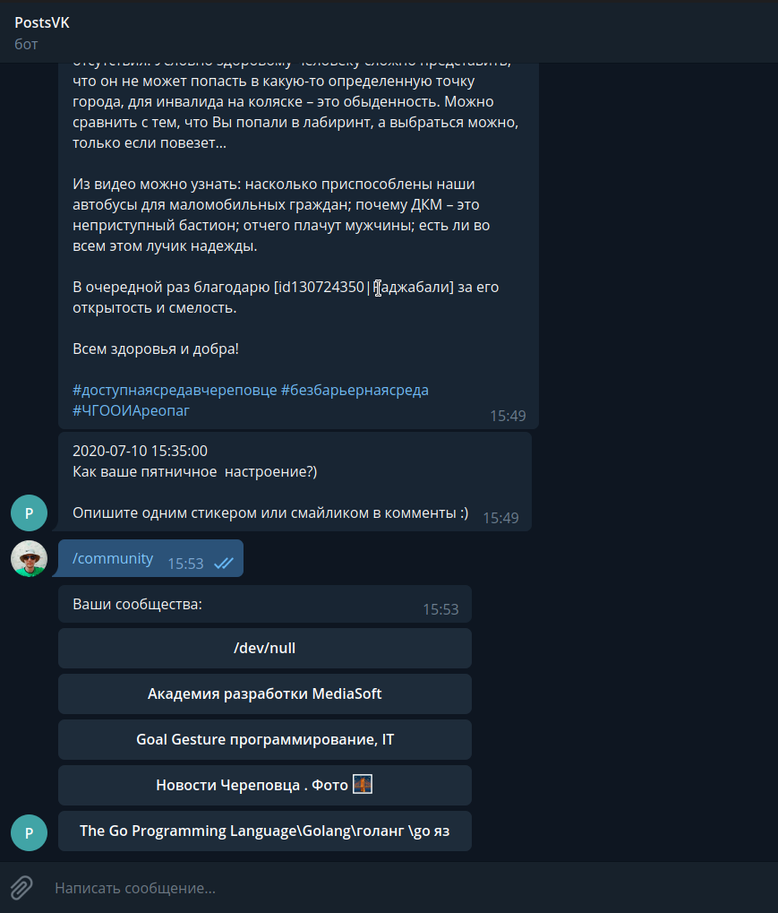

# BotPostsVK

Телеграмм бот, который выводит посты вконтакте открытых сообществ вконтакте.

__Теперь новости интересующих вас сообществ в вконтакте можно будет смотреть через телеграмм бота!__


## Установка

Нужно создать Standalone-Приложение вконтакте, для доступа к API. После получить access_token по следующему url, указав в качестве параметра id идентификатор своего приложения вконтакте:

```
https://oauth.vk.com/authorize?client_id=&display=page&redirect_uri=&scope=wall,photos,video&response_type=token&v=5.52
```

Ввести полученный токен в config.py поле VK_TOKEN. В поле BOT_TOKEN ввести токен от вашего бота 


[Маленькая демонстрация](https://youtu.be/UpGJp-h3c8U)



